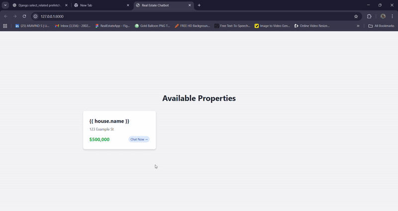
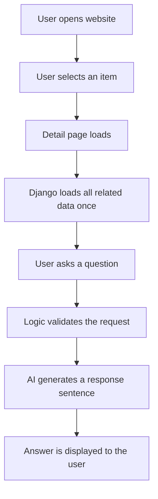

# Context Chat Module (Django + Local AI)

### Setup & Usage Screenshots

.png)

## Alright, I’ll first explain the main idea of this project in a simple way.

Think of any website where you have a detail page — it can be a building, a product, a service, or any single item that has many fields stored in the database.

On that detail page, the user can type a question. For example, if it’s a building page, the user might ask something like “Is there a hospital nearby?” or “How is transportation here?”

Now, when the user asks a question, Django takes control first. Django already knows which item the user is looking at, because the user is on that specific detail page. So Django loads all the data related to that one item from the database. It uses Django’s select_related to join the related tables efficiently and load everything once into memory.

After that, Django looks at the user’s question and tries to understand what the user is asking. This is done using simple keyword rules written in the code. For example, if the question contains words like “hospital” or “medical”, Django knows the user is asking about medical facilities.

Once Django understands the intent, it picks only the relevant fields from the data it already has in memory. Then it creates a clean JSON-like structure with just the information needed for that question.

Now comes the AI part. Django sends this structured data along with the user’s question to the Ollama server. Ollama already has a fixed instruction that says it should reply only using the provided data and should not guess or add anything extra.

Ollama’s job is very simple here. It does not think, search, or decide anything. It just takes the data and turns it into a natural, human-readable sentence.

Finally, Django receives that response and sends it back to the frontend, where the user sees the answer.

So basically, Django is the brain that controls data and logic, and Ollama is just the voice that explains things nicely. This same approach can be used anywhere you have a single product or entity page and want a chatbot to clearly explain details using AI.

## Overview

The **Context Chat Module** is a reusable chatbot module designed for single-entity detail pages. It allows users to ask natural language questions about the currently viewed item (property, product, listing, profile, or any structured record) and receive accurate answers based **only** on verified database data.

Although demonstrated using a real estate example, this module can be integrated into any detail page where structured data exists, with minimal changes.

## Core Principle

The chatbot works using a fixed, single-entity context:
- **One entity is selected** by the user.
- **All related data is loaded once**.
- The chatbot answers questions using **only that data**.
- **No database queries** are made during chat messages.

This approach ensures accuracy, performance, and safety.

## What This Module Is Designed For

This module can be used on:
- 🏠 Property detail pages
- 📦 Product detail pages
- 🛠️ Service detail pages
- 📋 Catalog item pages
- 👤 Profile pages
- *Any page that displays one structured record at a time*

## Capabilities

### What the Module Does
- ✅ Answers questions in simple language.
- ✅ Uses only verified database data.
- ✅ Responds quickly.
- ✅ Never guesses or invents information.

**Example questions:**
- "Is there a hospital nearby?"
- "Is this suitable for families?"
- "How is transportation here?"
- "What related facilities are available?"

### What the Module Does Not Do
- ❌ It does not search across multiple entities.
- ❌ It does not filter or rank records.
- ❌ It does not compare one record with another.
- ❌ It does not allow AI to decide facts.

*Search, filtering, and listing logic are handled outside this module.*

## Technology Stack

- **Backend**: Django
- **Database**: SQLite (development), PostgreSQL supported
- **AI Engine**: Ollama (local)
- **AI Model**: Mistral 7B Instruct
- **Interface**: Web UI (Tailwind) and optional CLI
- **AI Endpoint**: `http://localhost:11434`

The AI runs locally and is accessed through a simple HTTP request.

## Data Model Concept

The module assumes a structured relational database with:
1. A **Primary Entity** (e.g., House, Product, Item)
2. **Related Entities** (e.g., Facilities, Features, Attributes)
3. A **Linking Table** that defines relationships

**Example (Real Estate Case):**
- **Primary Entity**: `House`
- **Related Entity**: `Place`
- **Link Table**: `HouseDistance`

This structure can be changed to match any domain.

### Database-Driven and Schema-Flexible
The module is **schema-driven**, not domain-locked. You can:
- Add or remove related tables.
- Change categories or attributes.
- Modify relationships.

As long as the context builder produces a clean data structure, the chatbot logic remains unchanged. This makes the module scalable and adaptable.

## Data Loading Strategy

When a detail page is opened:
1. Django loads the selected entity.
2. Related data is joined using efficient queries.
3. Data is flattened into a single in-memory structure.
4. This structure becomes the **only source of truth**.
5. No database queries occur during chat messages.

## Logic and Safety Layer

Before calling the AI, the system always:
1. **Understands** the user’s intent.
2. **Checks** whether requested data exists.
3. **Rejects** unsupported or out-of-scope questions.
4. **Calls AI** only when valid data is available.

**Handling Missing Data:**
> "Sorry, that information isn’t available for this item yet."

**Handling Unsupported Requests:**
> "I can help with information related to this item only."

## AI Usage Policy

The AI is used **only** for language generation.
- It receives only approved data.
- It does not access the database.
- It does not infer missing information.
- It does not compare entities.

The AI converts structured facts into clear sentences.

## End-to-End Flow

## Why This Design Works

- **Fast response time**: No repeated database queries.
- **No AI hallucinations**: Strict data boundaries.
- **Easy to debug**: Clear separation of concerns.
- **Easy to maintain**: Modular code.
- **Works under high traffic**: Efficient data loading.

## Scalability and Reusability

This module is scalable because:
- Only **one entity** is loaded into memory.
- Performance does not depend on total dataset size.
- Works with any relational database supported by Django.
- Supports schema changes without redesigning the chatbot.

The same module can be reused across different domains and projects.

## Production Readiness

- Compatible with PostgreSQL.
- Safe for multi-user environments.
- Controlled AI usage.
- Modular and maintainable.
- Suitable for real-world deployment.